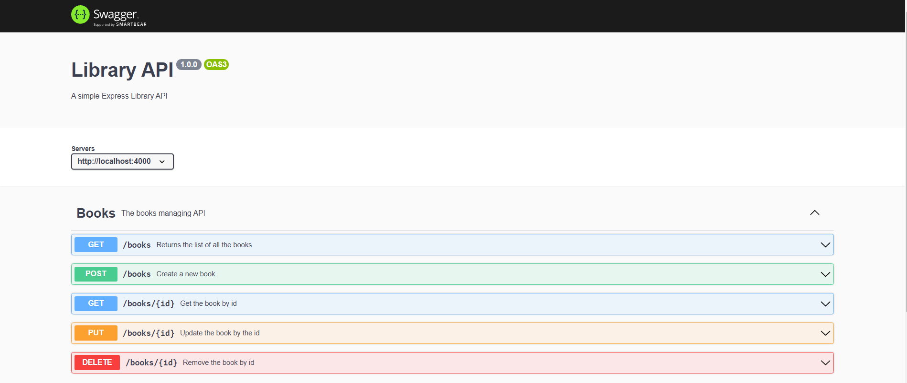
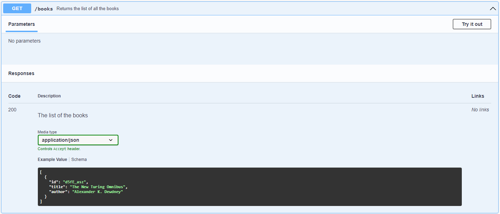
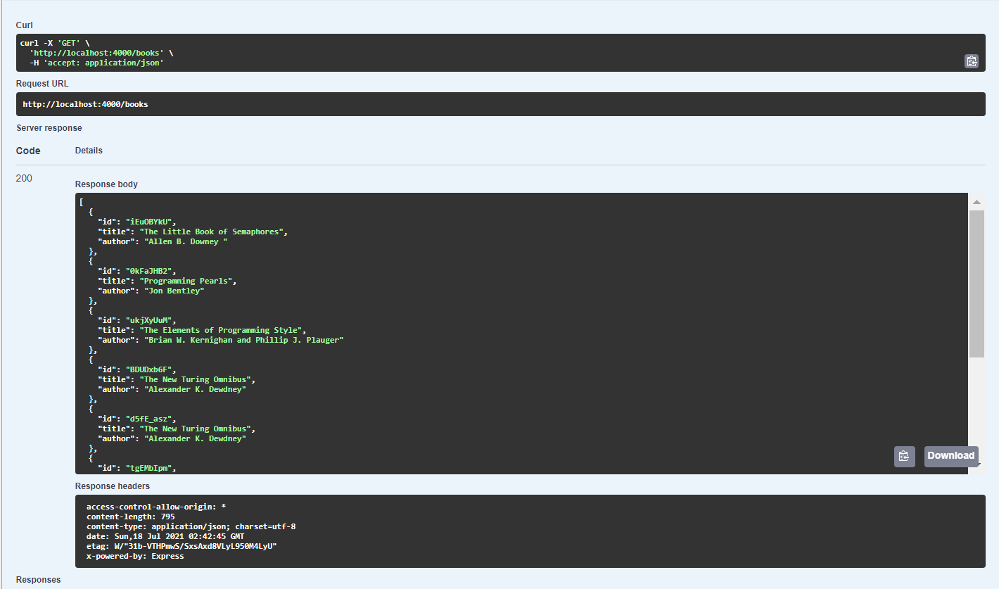
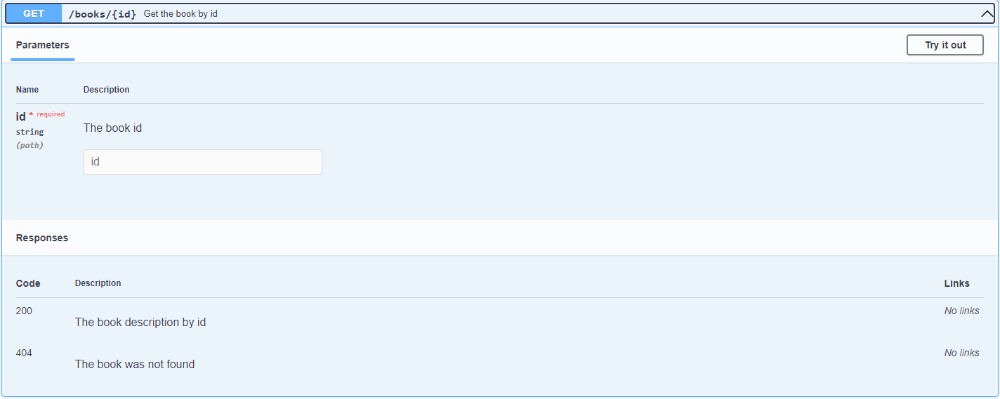
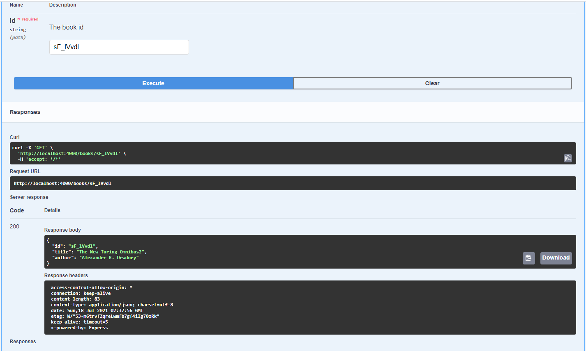
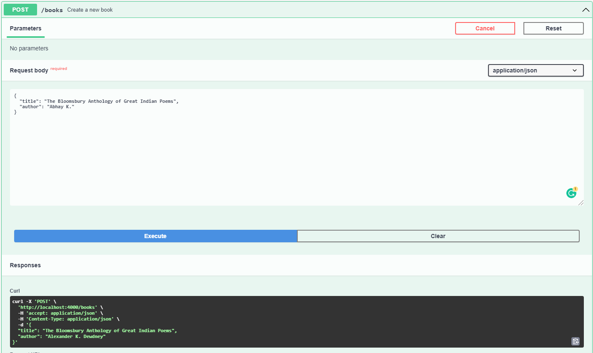
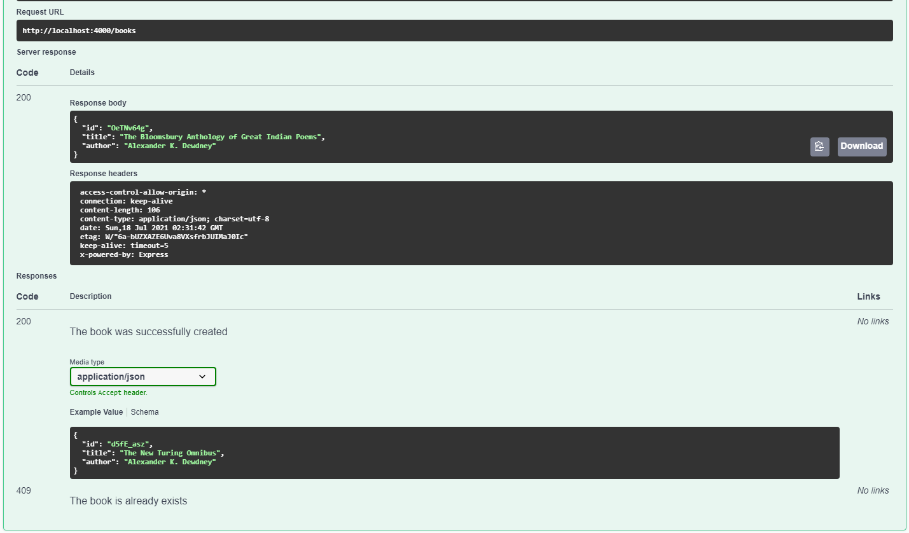
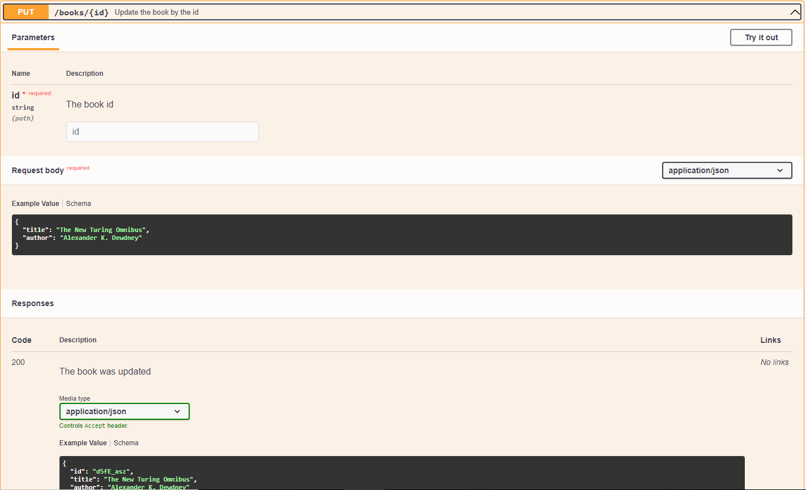
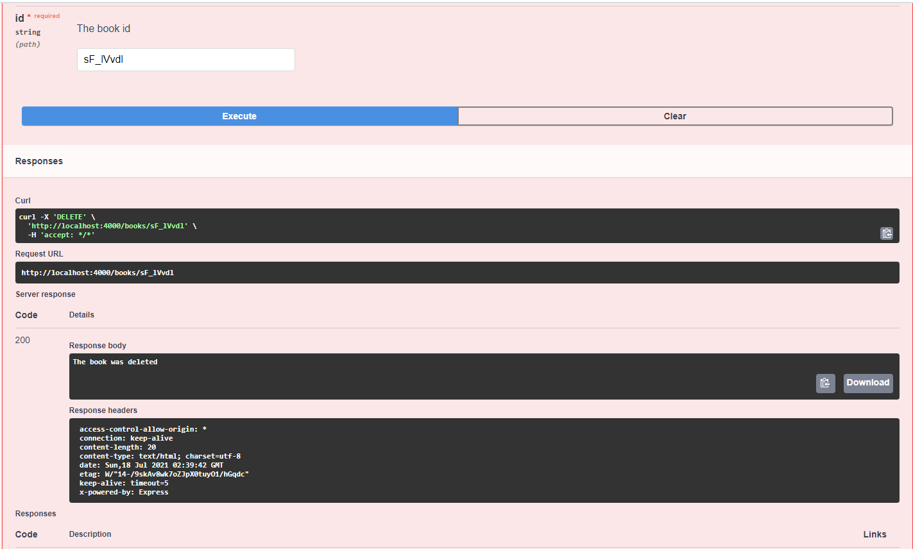

# Swagger-api-with-nodeJs

> Simple CRUD RESTful API using Swagger with NodeJs-Express

 **The Schemas**

---
---

>## Get All Books

---

>## Get a Book

---
>## Add a Book

---
>## Update a Book

---
>## Delete a Book

